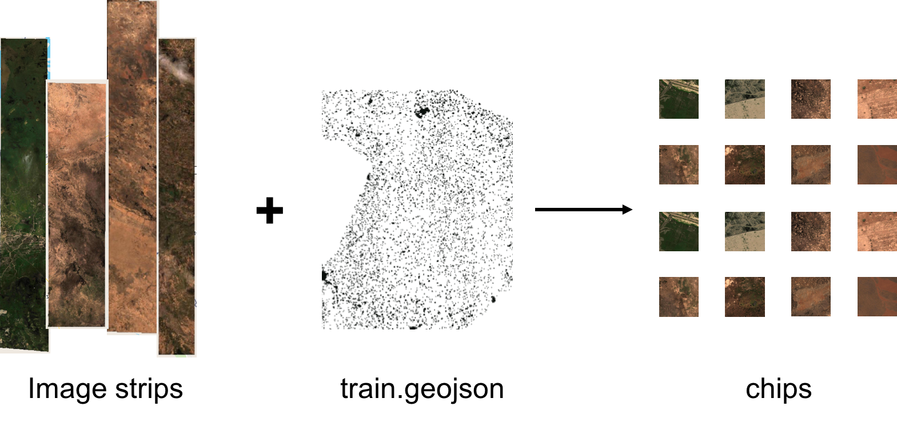
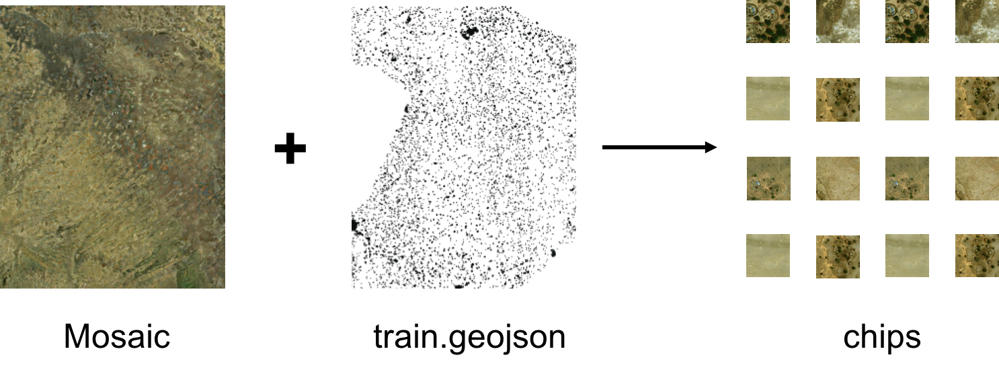

## chipper-from-vrt

### Table of Contents

1. [About](#about)
2. [Executing the Task](#executing-the-task)
    - [Chip from Strips](#chip-from-strips)
    - [Chip from Mosaic](#chip-from-mosaic)
3. [Inputs](#inputs)
4. [Advanced](#advanced)

### About

A GBDX task for generating AOI chips from imagery on S3. Imagery can be either a FLAME mosaic or a group of individual image strips on S3. AOIs are provided in a geojson file. Chips are saved to a user-defined S3 location along with a reference geojson 'ref.geojson', which contains all features that were chipped out.

If there is spatial overlap between input images, content will be fetched from the files listed at the end on the imagery_location input.


### Executing the task


#### Chip from strips



1. Within an iPython terminal create a GBDX interface:

    ```python
    from gbdxtools import Interface
    from os.path import join
    import uuid

    gbdx = Interface()
    input_location = 's3://gbd-customer-data/58600248-2927-4523-b44b-5fec3d278c09/platform-stories/building-detection-large-scale/'

    ```

2. For imagery on the gbd-customer-data bucket you will need to set S3 credentials (including a session token). It is recommended to request credentials that last for 36 hours to ensure they last for the duration of the task. Do so by sending a post to ```https://geobigdata.io/s3creds/v1/prefix?duration=129600``` and using these values as the aws credentials below.

    ```python
    inf = gbdx.s3.info          # Skip this if using 36 hr credentials
    access_key = inf['S3_access_key']
    secret_key = inf['S3_secret_key']
    session_token = inf['S3_session_token']
    ```

3. Create a task instance and set the required [inputs](#inputs):

    ```python
    # Define imagery input location
    imagery_input = join(input_location, 'strip-imagery')

    # Create task and set inputs
    strip = gbdx.Task('chip-s3-imagery')
    strip.inputs.geojson = join(input_location, 'strip-geojson')
    strip.inputs.imagery_location = ', '.join([join(imagery_input, '1040010014BCA700.tif'), join(imagery_input, '1040010014800C00.tif')])
    strip.inputs.aws_access_key = access_key
    strip.inputs.aws_secret_key = secret_key
    strip.inputs.aws_session_token = session_token
    ```

4. Set the domain to raid if chipping more than 10000 AOIs to speed up execution:

    ```python
    strip.domain = 'raid'
    ```

5. Create a workflow from the task and specify where to save the output chips:

    ```python
    # Specify output location with random string
    random_str = str(uuid.uuid4())
    output_location = join('platform-stories/trial-runs', random_str)

    strip_wf = gbdx.Workflow([strip])
    strip_wf.savedata(strip.outputs.chips, join(output_location, 'chips'))
    ```

6. Execute the workflow

    ```python
    strip_wf.execute()
    ```

#### Chip from mosaic



1. Within an iPython terminal create a GBDX interface:

    ```python
    from gbdxtools import Interface
    from os.path import join
    import uuid

    gbdx = Interface()

    # Specify location of input files
    input_location = 's3://gbd-customer-data/58600248-2927-4523-b44b-5fec3d278c09/platform-stories/chipper-from-vrt/'
    ```

2. Create a task instance and set the required [inputs](#inputs):

    ```python
    mosaic = gbdx.Task('chip-s3-imagery')
    mosaic.inputs.geojson = join(input_location, 'mosaic-geojson/')
    mosaic.inputs.imagery_location = 'flame-projects/335-dikwa-nigeria'
    mosaic.inputs.mosaic = 'True'
    mosaic.inputs.aws_access_key = 'access_key'     # Required for non-public mosaic (need read access)
    mosaic.inputs.aws_secret_key = 'secret_key'     # Required for non-public mosaic (need read access)
    ```

3. Set the domain to raid if chipping more than 10000 AOIs to speed up execution:

    ```python
    mosaic.domain = 'raid'
    ```

4. Create a workflow from the task and specify where to save the output chips:

    ```python
    # Specify output location with random string
    random_str = str(uuid.uuid4())
    output_location = join('platform-stories/trial-runs', random_str)

    # Create the workflow and save the output to output_location
    mosaic_wf = gbdx.Workflow([mosaic])
    mosaic_wf.savedata(mosaic.outputs.chips, join(output_location, 'mosaic-chips'))
    ```

5. Execute the workflow:

    ```python
    mosaic_wf.execute()
    ```


### Inputs

| **Parameter:**  | Description:                                                     |
|-----------------|------------------------------------------------------------------|
| geojson | Directory:, Contains a geojson file with geometries to extract from imagery. **Properties must include class names if the chips are to be used for training**. If a feature_id property is not provided it will be generated by the task and included in ref.geojson. |
|  imagery_location | String: location of imagery from which to chip. this can either be to a mosaic (bucket/path/to/project/) or full path to image strips, each separated by a comma (bucket/path/to/image_1.tif, bucket/path/to/image_2.tif) |  
|  mosaic | String ('boolean'): True if imagery is a mosaic (task will expect imagery_location to be a FLAME project directory). If False task will expect one or more paths to an imagery strip. |  
|  aws_access_key | String: AWS access key that has read rights to the bucket with imagery (only necessary if imagery is in private bucket). |  
|  aws_secret_key | String: AWS secret access key with read rights to the bucket containing imagery (only necessary if imagery is in private bucket). |  
|  aws_session_token | String: AWS session token for bucket with imagery. Necessary for any imagery in the gbd-customer-data bucket. It is recommended to use a 36-hour token (gbdxtools currently defaults to 10 hours). |  
|  mask | String ('boolean'): blackfill any pixels that exist outside of the polygon. Otherwise entire bounding box will be included in the output chip. |  

### Advanced

When chipping a large number of AOIs (>10000) from image strips it is recommended to use internal tiling to speed up the task. To accomplish this you may use the ```tile-strips``` gbdx task on each image as follows:

```python
from gbdxtools import Interface()
gbdx = Interface()

tiler = gbdx.Task('tile-strips', images = 's3://bucket/prefix/path/to/imagery/')
tiler_wf = gbdx.Task([tiler])

# This will overwrite original images with tiled versions
tiler_wf.savedata(tiler.outputs.tiled_images, 'path/to/imagery/')

tiler_wf.execute()
```
